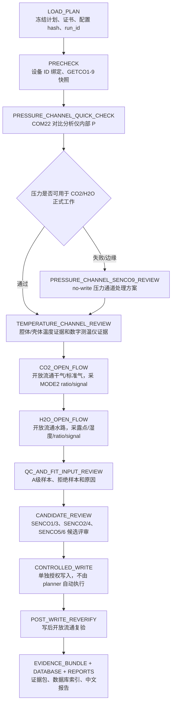

# V1.5 正式校准入口调用图

本文件是维护视图，目的不是新增流程，而是把当前已经验证过的 V1.5 正式路线和代码入口固定下来，避免后续在 V1、V2、诊断工具、旧脚本之间走错。

## 总边界

- 不修改 `run_app.py` 默认入口。
- 不把 V2 接回 V1.5 正式真机流程。
- COM 口只是传输路径，设备身份以 MODE2/device ID 为准。
- 设备 ID 不允许在初始化或校准中被自动改写。
- 封路控压多压力点、动态控压探针、PACE continuous sink、VENT-hold 只能作为工程诊断保留，默认不进入正式 CO2/H2O 拟合，也不能作为 real acceptance。
- 控制写入类工具只允许在已有审批、旧系数快照、写入读回和写后复验计划齐全后单独执行，不能由全流程 planner 自动触发。

## 物理主流程

## 入口分层

| 层级 | 入口 | 物理意义 | 风险边界 |
|---|---|---|---|
| 全流程计划器 | `src/gas_calibrator/tools/run_v1_5_full_calibration_chain.py` | 生成正式流程计划、状态和命令清单 | 默认 dry-run/planner，不打开 COM、不控阀、不写系数 |
| 全流程合同 | `src/gas_calibrator/v1_5/orchestration/full_flow.py` | 固定压力先行、温度证据、CO2/H2O 开放流通、写后复验顺序 | 只描述和监督，不把写入步骤自动化 |
| 串口/身份绑定 | `src/gas_calibrator/v1_5/orchestration/serial_port_binding.py` | COM 口漂移时仍以设备 ID 识别分析仪 | 参考设备 COM16-COM23/COM24-COM31 漂移检测默认关闭；分析仪 COM35-COM42 受保护 |
| 压力快速验证 | `src/gas_calibrator/tools/validate_pressure_only.py` | 验证分析仪内部 P 是否可信，避免把压力错误混入 CO2/H2O 拟合 | 真机压力验证需授权；必须持续通大气；失败时先进入 SENCO9 no-write 评估 |
| 压力 no-write 评估 | `src/gas_calibrator/tools/export_v1_5_pressure_senco9_no_write_preflight.py` | 只评估是否需要 SENCO9 处理 | 离线侧车，不写 SENCO9 |
| 温度通道评审 | `src/gas_calibrator/tools/export_v1_5_temperature_channel_review.py` | 评审 SENCO7/8 与数字测温仪证据，判断温度输入是否可信 | 离线评审；不自动写温度系数 |
| CO2 开放流通 runner | `src/gas_calibrator/tools/run_v1_5_formal_co2_open_flow_queue.py` | 持续开放流通标准气，采集 MODE2 ratio/raw ratio/signal、压力、温度 | 真机气路需授权；不使用封路压力点做正式拟合 |
| H2O 开放流通 runner | `src/gas_calibrator/tools/run_v1_5_formal_h2o_open_flow_queue.py` | 持续开放流通水路，采集露点、H2O 参考、MODE2 ratio/signal | 真机水路需授权；干气低水锚点必须有露点/参考证据 |
| 输入质量评审 | `src/gas_calibrator/tools/export_v1_5_fit_input_quality.py` | 审核进入拟合的数据是否稳定、可追溯、角色合格 | 离线；拒绝样本必须保留原因 |
| CO2 候选评审 | `src/gas_calibrator/tools/export_v1_5_co2_senco_pair_model_scope.py` | 评审 SENCO1/3 主链路和 SENCO5 显示层修正 | 当前大气压 V1.5 策略下冻结压力项；SENCO5 不混入主拟合 |
| H2O 候选评审 | `src/gas_calibrator/tools/export_v1_5_h2o_senco24_candidate_review.py` | 评审 SENCO2/4 主链路和 SENCO6 显示层修正 | H2O 干气锚点与 CO2 零气锚点不能混为一类 |
| 控制写入 | `run_v1_5_*_controlled_write.py` | 写入 SENCOx 并读回，形成新 coefficient epoch | 高风险工具；必须单独授权；写完必须复验 |
| 写后复验 | `src/gas_calibrator/tools/export_v1_5_post_write_reverification.py` | 用写后开放流通点证明新系数输出仍与标准/参考一致 | 写入成功不等于校准通过；复验是独立门禁 |
| 证据包和数据库 | `prepare_v1_5_canonical_evidence_package.py`、`import_v1_5_evidence_package.py` | 保存原始帧、QC、系数、写入、复验、报告 hash 的可追溯索引 | 数据库是证据链索引，不替代原始 artifact |
| 中文报告 | `src/gas_calibrator/tools/export_v1_5_calibration_reports.py` | 从证据包生成运行报告、技术报告、正式报告 | 报告生成不打开串口、不控路、不写设备 |

## 正式顺序的关键理由

1. **压力先行**：CO2/H2O 内部算法包含压力 P，SENCO9 是压力通道系数；如果 P 不可信，组分校准会把压力错误吸收到浓度误差里。
2. **温度证据在组分评审前**：CO2/H2O 公式包含温度 T，腔体/壳体温度异常会影响 ratio 到浓度的解释；温度可以先评审，必要时再做受控温度校准。
3. **开放流通是主校准物理基础**：持续刷新光学腔体和管路，避免封闭死体积、残余湿气、压力探针污染进入正式拟合。
4. **ratio/signal 是主拟合证据**：初始化前设备已有系数，显示浓度会被旧 SENCO 与 S5/S6 修正影响；候选主系数应基于 MODE2 工厂信号和可追溯参考。
5. **S5/S6 是显示层线性修正**：SENCO5 修 CO2 最终浓度，SENCO6 修 H2O 最终浓度；不能把 S5/S6 混进 SENCO1/3 或 SENCO2/4 主拟合。
6. **写后复验是独立门禁**：写入读回只能证明命令落入设备，不能证明新测量模型有效；必须用独立开放流通点验证。

## 当前已完成度判断

- 已有 V1.5 full-flow planner 和状态机，能生成顺序、命令、状态和安全边界。
- 压力、CO2、H2O、候选系数、控制写入、写后复验、证据包、数据库、报告均已有独立入口和测试覆盖。
- full-flow planner 仍默认不会自动执行真机路线，也不会自动写系数；这是安全设计，不是缺失。
- 下一步应把“证据包 -> 数据库 -> 中文报告 -> UI 状态”串成更顺的离线闭环，再做新 UI。

## 后续整理任务

1. 把 full-flow planner 的中文文案和 UI 状态合同进一步中文化。
2. 把数据库导入状态、写后复验状态、报告发布门禁接到同一 review surface。
3. 把 S1/3、S2/4、S5/6 的当前正式计算合同写成单独算法合同文档，并用最近真机数据做回放测试。
4. 新 UI 只接 V1.5 状态和证据合同，不复用 V1 老界面，不默认执行真实写入。
