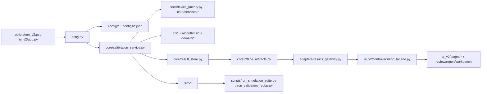

# V2 软件架构说明

## 1. 范围与原则

V2 当前的工程目标不是替代 V1，而是把 Step 2 所需的仿真、治理、评审和产品化骨架做稳。软件架构因此围绕三件事组织：

- 运行主链路必须可在 simulation-only 环境闭环。
- 所有结果都要可沉淀为离线可评审工件。
- UI、suite、parity、resilience 必须和同一套领域模型与证据边界对齐。

不在当前架构目标内的内容：

- 默认入口切到 V2
- 真实设备联调与真实验收
- 把 V2 新功能回接到 V1 UI

## 2. 总体分层

这张图可以理解成两条主线共享同一套核心：

- 运行主线：`entry.py -> CalibrationService -> DeviceFactory / services -> ResultStore`
- 治理主线：`ResultStore -> offline_artifacts -> results_gateway -> UI / suite / review`

## 3. 关键入口

| 入口 | 作用 | 当前使用方式 |
| --- | --- | --- |
| `entry.py` | V2 正式构造入口，负责配置解析、路径归一化、Step 2 配置门禁和服务创建。 | 供脚本、UI、测试共同复用。 |
| `scripts/run_v2.py` | CLI 入口，支持 headless 与 UI 两种模式。 | 用于安全仿真运行，不用于真实设备。 |
| `ui_v2/app.py` | V2 Tk UI 启动器。 | 默认中文界面，面向 review/report/workbench 体验。 |
| `scripts/test_v2_safe.py` | Step 2 安全自检。 | 优先用于 smoke 级别验证。 |
| `scripts/run_simulation_suite.py` | 套件化运行 smoke / regression / nightly / parity。 | 用于日常门禁与工件沉淀。 |
| `scripts/run_validation_replay.py` | 从 replay fixture 生成离线验证证据。 | 用于回放，不写真实验收结论。 |

## 4. 模块地图

### 4.1 运行核心

| 模块 | 代表文件 | 职责 |
| --- | --- | --- |
| 运行编排 | `core/calibration_service.py`、`core/orchestrator.py` | 组织点位加载、执行、状态推进、设备管理与收尾。 |
| 设备抽象 | `core/device_factory.py`、`core/device_manager.py` | 根据配置创建真实或仿真设备对象；在 Step 2 默认走仿真。 |
| 运行服务 | `core/services/*` | 拆分采样、压力、温度、阀路、QC、状态等垂直能力。 |
| 领域模型 | `domain/*` | 定义计划、结果、枚举、点位与样本对象，作为 UI/存储/分析共享合同。 |

### 4.2 数据质量与算法

| 模块 | 代表文件 | 职责 |
| --- | --- | --- |
| QC | `qc/pipeline.py`、`qc/rule_registry.py`、`qc/qc_report.py` | 异常样本处理、规则注册、评分与证据输出。 |
| 标定算法 | `algorithms/engine.py`、`algorithms/registry.py` | 线性、多项式、AMT 等算法注册、比较和自动选择。 |
| 分析 | `analytics/service.py`、`analytics/feature_builder.py` | KPI、健康度、漂移、控制图等离线分析能力。 |

### 4.3 输出与治理

| 模块 | 代表文件 | 职责 |
| --- | --- | --- |
| 结果存储 | `core/result_store.py` | 写 `results.json`、`point_summaries.json`、`summary.json`、`manifest.json` 等基础工件。 |
| 离线工件 | `core/offline_artifacts.py` | 生成 analytics、lineage、evidence registry、review digest、suite 汇总等治理工件。 |
| 网关 / 适配器 | `adapters/results_gateway.py`、`adapters/*_gateway.py` | 把运行工件整理成 UI、历史扫描、报告页可消费的数据。 |
| 存储 | `storage/*` | profile、数据库、导入导出与运行数据装载。 |

### 4.4 仿真与回放

| 模块 | 代表文件 | 职责 |
| --- | --- | --- |
| 仿真协议 | `sim/protocol.py` | 按场景驱动协议级仿真 compare。 |
| 回放 | `sim/replay.py` | 从 fixture 物化离线回放结果。 |
| parity | `sim/parity.py` | 汇总 V1/V2 口径对齐结果。 |
| resilience | `sim/resilience.py` | 导出韧性和缺失工件兜底检查。 |
| 场景目录 | `sim/scenarios/catalog.py`、`sim/scenarios/suites.py` | 定义 scenario、profile、suite 与预期状态。 |
| 仿真设备 | `sim/devices/*` | 分析仪、压力、温箱、继电器等 fake 设备矩阵。 |

### 4.5 UI 层

| 模块 | 代表文件 | 职责 |
| --- | --- | --- |
| 应用壳 | `ui_v2/app.py`、`ui_v2/shell.py` | 启动、页面布局、恢复与应用级生命周期。 |
| 控制器 | `ui_v2/controllers/app_facade.py`、`device_workbench.py`、`run_controller.py` | 把 core/adapters 转成 UI 状态。 |
| 页面 | `ui_v2/pages/*` | 计划编辑、运行控制、结果、报告、设备、QC 等页面。 |
| 国际化 | `ui_v2/i18n.py`、`ui_v2/locales/zh_CN.json` | 中文默认、英文 fallback。 |

补充说明：

- `DeviceWorkbenchController` 明确是 simulation-only 控制器。
- `AppFacade` 是 review/report/workbench 的汇总编排层，也是 UI 与工件治理耦合最深的位置。

## 5. 典型运行数据流

### 5.1 仿真 headless 运行

1. `scripts/run_v2.py --headless --simulation` 调用 `entry.create_calibration_service`。
2. `entry.py` 装载 JSON 配置，补齐可选的 `storage_config.json` / `ai_config.json`，并执行 Step 2 配置门禁。
3. `CalibrationService` 通过 `DeviceFactory` 创建仿真设备，通过 `PointParser` 装载点位。
4. 运行过程中由 `core/services/*`、`qc/*`、`algorithms/*` 共同完成采样、稳定性检查、QC 与拟合。
5. `ResultStore` 落基础结果，随后 `offline_artifacts` 生成离线治理工件。
6. 输出目录进入 `output/.../run_<timestamp>`，供 UI、suite 与历史工件工具继续消费。

### 5.2 UI 查看与离线评审

1. `ui_v2/app.py` 创建 `AppFacade`。
2. `AppFacade` 通过 `ResultsGateway`、`offline_artifacts`、review surface helpers 汇总工件。
3. 页面层展示结果、报告、review digest、artifact scope 与 simulation-only workbench。
4. 用户看到的状态优先来自中文 i18n，不直接暴露内部英文 key。

## 6. 扩展建议

| 需求类型 | 优先落点 |
| --- | --- |
| 新的仿真场景 / suite | `sim/scenarios/catalog.py`、`sim/scenarios/suites.py` |
| 新的 QC 规则 | `qc/rule_templates.py`、`qc/rule_registry.py` |
| 新的分析指标 | `analytics/` 或 `core/offline_artifacts.py` |
| 新的报告/评审视图 | `adapters/results_gateway.py`、`ui_v2/controllers/app_facade.py`、`ui_v2/pages/*` |
| 新的运行设备能力 | `core/services/*`、`core/device_factory.py`，但 Step 2 默认仍要保持 simulation-only 验证路径 |
| 新的配置字段 | `config/models.py`、`configs/*.json`、相应 tests |

## 7. 当前架构约束

- 新功能默认不能改动 V1 生产逻辑。
- 不允许把 V2 的运行入口重新接回 `run_app.py`。
- 所有仿真 / 回放 / suite 工件都必须显式保留“非真实验收证据”的边界语义。
- UI 默认中文，英文仅为 fallback。
- 涉及口径变动时，必须把 parity 当作合同测试的一部分。
